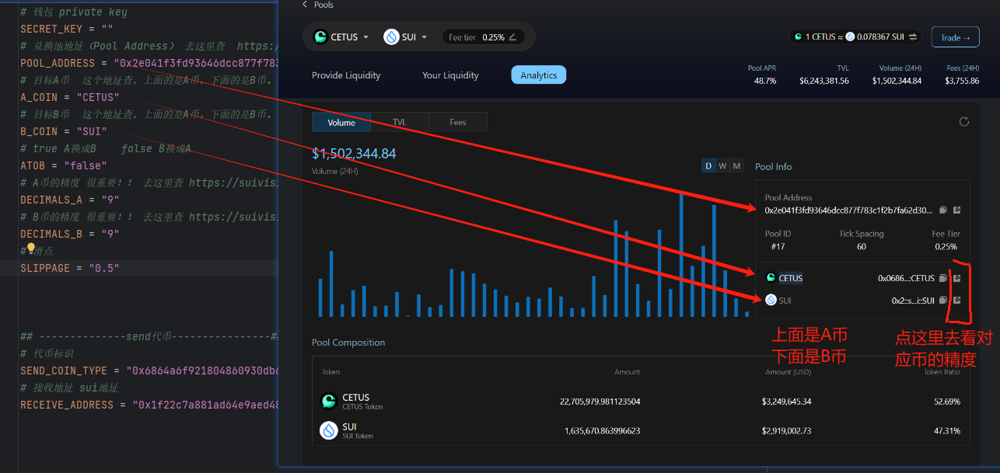
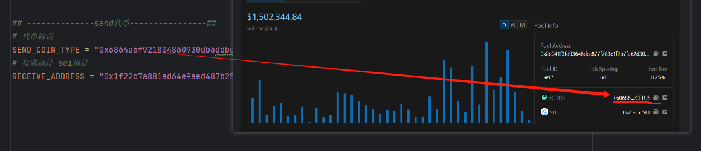

1. 加载依赖包
   ```shell
   npm install
   ```
2. 修改.env
打开cetus https://app.cetus.zone/liquidity/analytics?poolAddress=0x2e041f3fd93646dcc877f783c1f2b7fa62d30271bdef1f21ef002cebf857bded
选择对应的兑换币


#### swap代币
3. 运行cetus swap
   ```shell
   npm run cetus
   ```

#### 转移代币：

4. 运行sui send
    ```shell
    npm run send
    ```
   